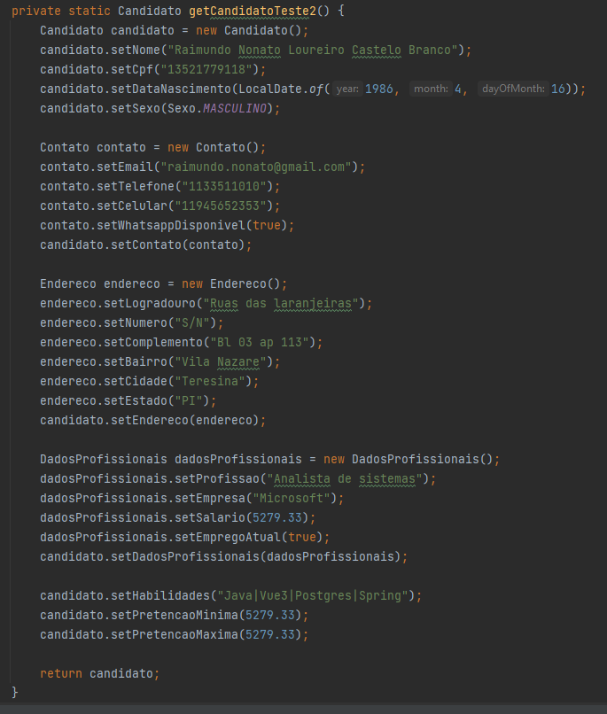

## Atividades realizadas durante o curso MJV School

### [proposta](https://sintaxe.netlify.app/topicos/aproposta#_1-2-a-proposta)
#### exportar um arquivo CSV com os dados dos canditatos no sistema

#### Classe para os objetos Candidato no sistema

#### Criando candidatos para serem exportado ultilizando as classes

#### Gravando os candidatos do sistema em arquivo CSV
#### se for um novo arquivo, gravar o cabeçalho

